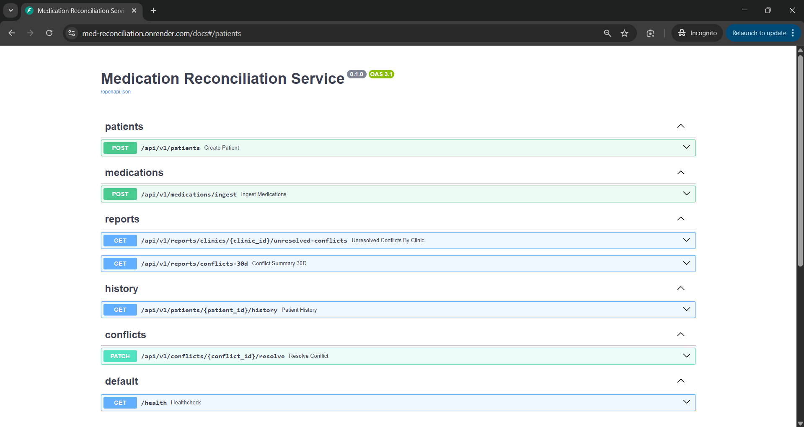
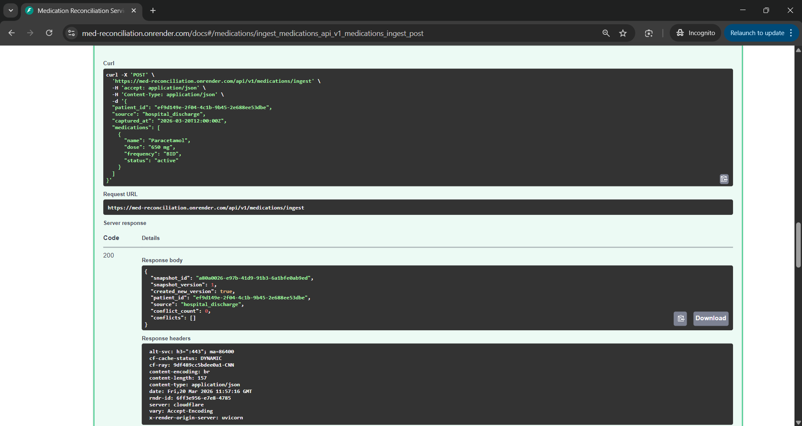
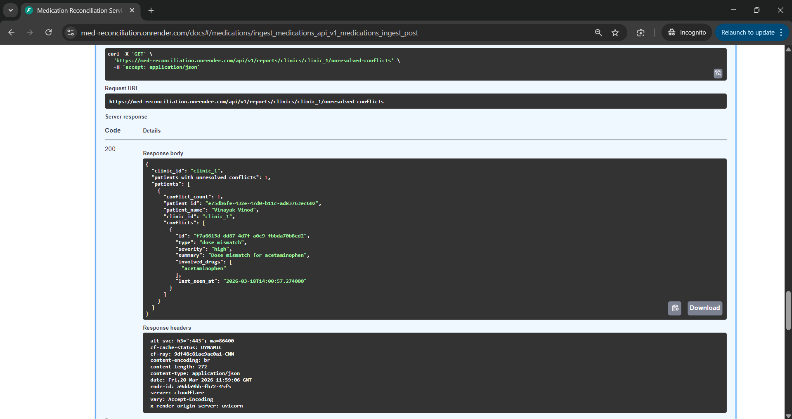
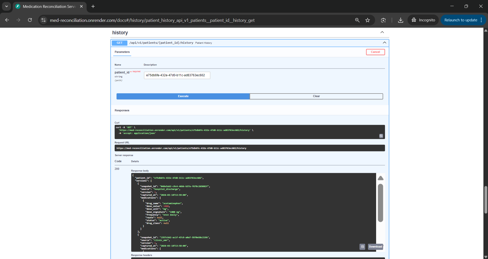

# Medication Reconciliation and Conflict Reporting Service

FastAPI + MongoDB MVP for ingesting multi-source medication lists, detecting unresolved conflicts, and reporting conflicts at clinic level.

## Live Demo
- API Docs: https://med-reconciliation.onrender.com/docs
- Health Check: https://med-reconciliation.onrender.com/health

## Deployment & API Proof

### Swagger UI (Service Live)



---

### Medication Ingestion (POST /medications/ingest)



---

### Conflict Detection (Core Feature)



---

### Patient History



---

### 🧪 Sample Scenario Tested

* Patient created with medications from multiple sources
* Conflicting medications detected automatically
* Conflict retrieved via reports API
* Conflict resolution endpoint verified


## Submission Snapshot
### Quick Start
```bash
python -m venv .venv
.venv\Scripts\activate
pip install -r requirements.txt
copy .env.example .env
uvicorn app.main:app --reload
```

### Test Command
```bash
pytest
```

### What Is Implemented
- Ingest medication lists by source (clinic_emr, hospital_discharge, patient_reported)
- Normalize medication payloads to a canonical internal representation
- Normalize equivalent dose units into mg for semantic comparison (for example 0.5 g == 500 mg)
- Parse common free-text dose formats using first numeric+unit token (for example "500 mg tablet")
- Normalize common frequency aliases (for example OD/QD and BID/BD)
- Detect five conflict types with severity levels (low/medium/high/critical): duplicate entry, dose mismatch, frequency mismatch, blacklisted class combination, active vs stopped mismatch
- Execute conflict checks using rule objects to keep rule growth maintainable
- Persist auditable conflict records with resolved/unresolved state and resolution metadata
- Persist conflict detection context (rules hash and compared snapshot references) for reproducibility
- Provide reporting endpoints:
	- unresolved conflicts by clinic
	- 30-day clinic summary with minimum conflict threshold
- Provide source-specific longitudinal snapshot history with versioning

### Deliverables (Quick Links)
- Schema and indexing rationale: [docs/schema.md](docs/schema.md)
- Architecture diagram: [docs/architecture.md](docs/architecture.md)
- Seed script: [scripts/seed_data.py](scripts/seed_data.py)
- Smoke evidence: [docs/smoke_evidence.md](docs/smoke_evidence.md)
- Postman collection: [docs/postman/Medication-Reconciliation-Smoke.postman_collection.json](docs/postman/Medication-Reconciliation-Smoke.postman_collection.json)
- Tests:
	- [tests/unit/test_conflict_detection.py](tests/unit/test_conflict_detection.py)
	- [tests/api/test_reporting_unresolved.py](tests/api/test_reporting_unresolved.py)
	- [tests/api/test_reporting_30d_edge_case.py](tests/api/test_reporting_30d_edge_case.py)
	- [tests/api/test_validation_errors.py](tests/api/test_validation_errors.py)

### Important Sections
- Recruiter summary: [Recruiter-Facing Architecture Summary](#recruiter-facing-architecture-summary)
- Demo script: [60-Second Interview Demo Script](#60-second-interview-demo-script)
- Known limitations: [Known Limitations with Mitigation Roadmap](#known-limitations-with-mitigation-roadmap)
- AI usage disclosure: [AI Usage Disclosure](#ai-usage-disclosure)
- Release checklist: [Release Checklist (Assignment 2)](#release-checklist-assignment-2)

## Setup (Under 5 Minutes)
1. Create and activate virtual environment.
2. Install dependencies.
3. Start MongoDB locally.
4. Copy .env.example to .env and adjust values if needed.
5. Run API server.

### Commands
```bash
python -m venv .venv
.venv\Scripts\activate
pip install -r requirements.txt
copy .env.example .env
uvicorn app.main:app --reload
```

API root: http://127.0.0.1:8000
OpenAPI docs: http://127.0.0.1:8000/docs

## Seed Data
```bash
python scripts/seed_data.py
```
Creates 12 synthetic patients across two clinics with mixed conflict scenarios.

## Manual Smoke Evidence
```bash
python scripts/manual_smoke.py
```
Generates request/response evidence in docs/smoke_evidence.md.

If local MongoDB is not available, the smoke script runs the same API endpoints with an in-memory repository override to keep the demo reproducible.

## Postman Collection (Smoke Flow)
- Import: docs/postman/Medication-Reconciliation-Smoke.postman_collection.json
- Set collection variable baseUrl if needed (default: http://127.0.0.1:8000)
- Run requests top-to-bottom:
  - healthcheck -> create patient -> ingest clinic -> ingest hospital -> unresolved report -> resolve conflict -> 30-day summary

## Test
```bash
pytest
```

## Deploy (Render + MongoDB Atlas)
### Render Service Settings
- Runtime: Python 3.11.9 (matches runtime.txt)
- Build command:
```bash
pip install -r requirements.txt
```
- Start command:
```bash
uvicorn app.main:app --host 0.0.0.0 --port $PORT
```

### Environment Variables (Render)
Set these in Render dashboard Environment:
```bash
MONGODB_URI=mongodb+srv://<db_user>:<url_encoded_db_password>@<cluster-host>/med_reconciliation?retryWrites=true&w=majority
MONGODB_DB=med_reconciliation
ENVIRONMENT=production
```

Notes:
- Do not commit real credentials to GitHub.
- If password contains special characters, URL-encode it (for example @ -> %40).
- Atlas Network Access must allow Render egress (for demo, 0.0.0.0/0).
- Atlas DB user must have readWrite on med_reconciliation.

## Architecture Overview
The system is structured into four layers.
1. API layer
- FastAPI routers and request/response contracts.
2. Domain layer
- Normalization and conflict detection business rules.
- Service orchestrates versioning, conflict lifecycle, and ingest flow.

3. Persistence layer
- Snapshot creation uses retry-safe unique version indexing per patient+source to reduce race-condition risk under concurrent ingests.

4. Config/data
- Static conflict rules JSON and environment settings.

Request flow:
- Ingest request -> normalize medications -> compare against latest source snapshot -> create version only on semantic change -> detect conflicts across latest sources -> upsert unresolved conflicts -> auto-resolve no-longer-detected conflicts -> return summary.

Architecture diagram (Mermaid): docs/architecture.md

## Recruiter-Facing Architecture Summary
This service is a FastAPI + MongoDB medication reconciliation backend designed for high-risk, multi-source clinical data.

- It ingests medication lists from three sources: clinic EMR, hospital discharge, and patient-reported.
- Incoming medications are normalized into a canonical model (name aliasing, dose/unit normalization, frequency normalization).
- Each ingest writes an immutable, source-scoped longitudinal snapshot with explicit versioning behavior for auditability.
- A conflict engine detects clinically relevant discrepancies across latest source states:
	- same drug, different dose
	- frequency mismatch
	- active vs stopped mismatch
	- duplicate entries in a source
	- blacklisted drug-class combinations
- Conflicts are stored with lifecycle metadata (unresolved/resolved), resolution reason, chosen source, resolver, timestamps, and detection context.
- Reporting endpoints provide operational visibility:
	- unresolved conflicts by clinic/patient
	- 30-day clinic summary for patients above a conflict threshold
- Architecture is separated across API routes, domain logic, and persistence, with tests for ingestion, conflict logic, validation, and reporting.

## Clinical Assumptions and Trade-offs
1. Dose conflict rule
- Same normalized drug name with differing dose signatures across active sources is flagged.

1.5. Frequency conflict rule
- Same normalized drug name with differing frequencies across active sources is flagged.

1.6. Duplicate entry rule
- Multiple active entries for the same normalized drug within the same source are flagged as potential duplicate therapy documentation.

2. Class combination rule
- Static blacklisted class pairs in config/conflict_rules.json represent unsafe combinations.
- This is a simplification and not a substitute for a real drug-interaction database.

2.5. Drug-name normalization
- Drug names are lowercased, punctuation-normalized, and can be mapped through config/conflict_rules.json aliases (for example, tylenol -> acetaminophen).

3. Stopped mismatch rule
- A medication marked active in one source and stopped in another is flagged.

4. Truth source policy
- No single source is considered globally authoritative.
- Conflicts remain unresolved until explicitly resolved by clinician action or auto-resolved when no longer detected in latest source state.

5. Versioning policy
- Immutable source snapshots with payload-hash deduplication.
- Bounded retry and unique patient+source+version index reduce version contention risk.

6. Conflict lifecycle policy
- Conflict state is persisted and conflict events (detected/resolved/reopened) are logged for auditability.

## API Endpoints
- POST /api/v1/patients
- POST /api/v1/medications/ingest
- GET /api/v1/reports/clinics/{clinic_id}/unresolved-conflicts
- GET /api/v1/reports/conflicts-30d?min_conflicts=2
- GET /api/v1/patients/{patient_id}/history
- PATCH /api/v1/conflicts/{conflict_id}/resolve

## Failure Modes and Handling
- Missing patient on ingest: 404.
- Invalid payload shape: 422 (Pydantic validation).
- Blank or whitespace-only required string fields are rejected.
- Non-positive dose values are rejected.
- Ingest requests must include at least one medication.
- captured_at must include timezone information.
- Unparseable dose text: stored without dose signature; does not crash ingest.
- Duplicate ingest payload for same source is deduplicated only when payload hash, source_reference, and captured_at all match.

## Known Limitations with Mitigation Roadmap
### Known Limitations
1. Clinical ontology depth is limited.
- Current synonym handling uses static aliases, not a complete medication terminology graph.
2. Ingest write flow is not transaction-bound end-to-end.
- Snapshot writes and conflict state updates are consistent by design but not wrapped in a single MongoDB transaction.
3. Concurrency validation is limited in automated tests.
- Most tests run on the in-memory repository; real MongoDB contention scenarios have lighter coverage.
4. Access control is not production-complete.
- Authentication/authorization and policy enforcement are intentionally out of assignment scope.
5. Observability is basic.
- Structured tracing, SLO alerting, and deeper operational dashboards are not fully implemented.

### Mitigation Roadmap
1. Phase 1: Clinical correctness hardening.
- Integrate standards-based medication terminology mapping.
- Expand rule configuration for richer dose/frequency semantics and confidence scoring.
2. Phase 2: Data integrity hardening.
- Introduce MongoDB transactions for ingest + conflict lifecycle transitions.
- Persist deterministic reconciliation-run artifacts for replay and forensic audits.
3. Phase 3: Reliability and scale.
- Add concurrency-heavy integration tests against real MongoDB.
- Expand indexing strategy and validate query cost under load.
4. Phase 4: Production readiness.
- Add authn/authz, access audits, and PHI-safe operational controls.
- Add structured telemetry (trace IDs, event metrics, latency/error budgets).
## AI Usage Disclosure
1. AI used for
- Initial scaffold planning, boilerplate route/repository generation, and test case brainstorming.

2. Manually reviewed and changed
- Conflict identity logic, snapshot versioning behavior, and unresolved-reporting query shape.

3. One disagreement with AI output
- Rejected a proposed approach that embedded conflicts directly inside snapshots because it would complicate clinic-level unresolved conflict reporting and indexing.

## Release Checklist (Assignment 2)
- [x] MongoDB schema description and indexing rationale documented: docs/schema.md
- [x] FastAPI service implemented with ingest, normalization, conflict detection, and reporting endpoints
- [x] Synthetic dataset generator included (12 patients with varied conflicts): scripts/seed_data.py
- [x] Tests added for core requirements:
	- [x] Conflict detection edge cases (dose mismatch, stopped mismatch, class combination)
	- [x] Missing fields and malformed payload handling (validation error tests)
	- [x] At least one aggregation endpoint
- [x] Smoke-flow evidence documented: docs/smoke_evidence.md
- [x] Postman collection export included: docs/postman/Medication-Reconciliation-Smoke.postman_collection.json
- [x] One-page architecture diagram included: docs/architecture.md

