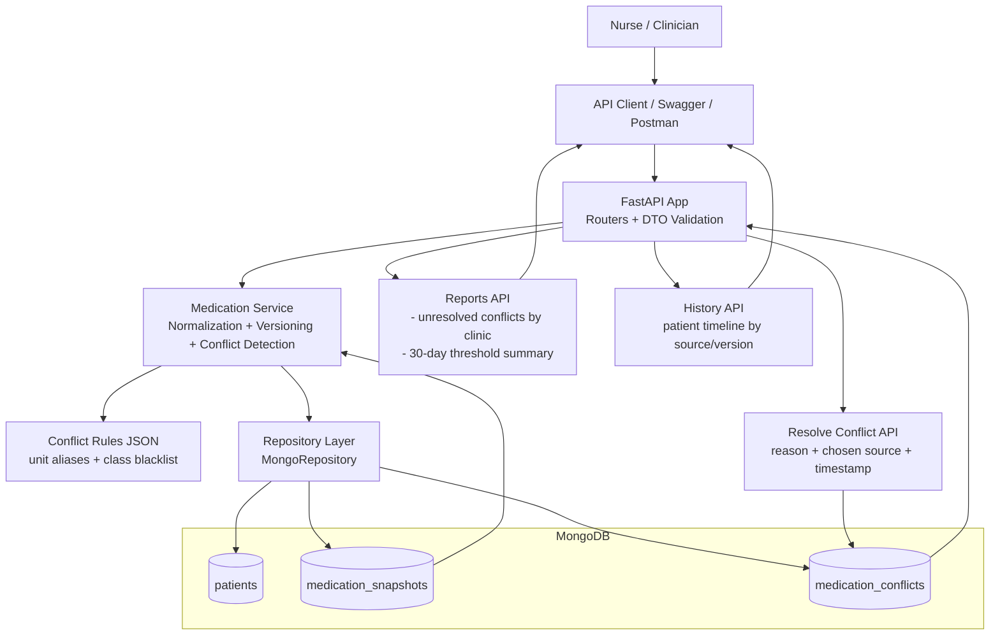

# Architecture Diagram

This one-page view shows the runtime request path and how conflict/reporting data is stored for auditability.

## Notes
- Snapshot versions are immutable per patient+source and only increment on semantic payload changes.
- Conflict records are stored as separate documents for reporting performance and audit trail clarity.
- Resolution is explicit and auditable via reason, selected source, resolver, and timestamp.
